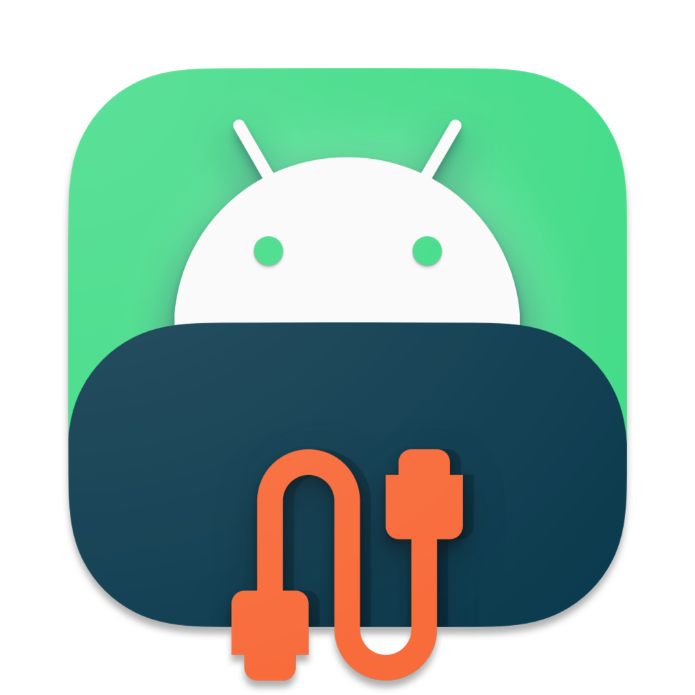

<div align="center">
  
  <h1>DroidView</h1>
  
  [](https://github.com/genx/DroidView/actions)
  [](https://crates.io/crates/droid_view)
  [](https://www.gnu.org/licenses/gpl-3.0)
  [](https://github.com/emilk/egui)
  [](https://www.rust-lang.org/)
  [](https://github.com/genx/DroidView)
  
  A modern, user-friendly graphical frontend for [scrcpy](https://github.com/Genymobile/scrcpy) and ADB, enabling you to mirror, control, and manage your Android devices from your desktop.
</div>

## Features
- Device detection and management
- Launch and control scrcpy sessions
- Wireless ADB pairing and TCP/IP support
- Toolkit: screenshots, screen recording, APK install, file manager
- Customizable settings (bitrate, orientation, theme, etc.)
- Panel-based UI (swipe, toolkit, quick actions)
- Cross-platform (Linux, macOS, Windows)

## Installation
1. Install [scrcpy](https://github.com/Genymobile/scrcpy) and [ADB](https://developer.android.com/studio/releases/platform-tools).
2. Build DroidView with Cargo:
   ```sh
   cargo build --release
   ```
3. Run the app:
   ```sh
   cargo run --release
   ```

## Usage
- Connect your Android device via USB or set up wireless ADB.
- Use the UI to detect devices, start scrcpy, and access toolkit features.
- Configure settings via the settings window (theme, bitrate, panels, etc.).

## Configuration
-  Platform	Config Path

| Platform | Config Path |
|----------|-------------|
| Windows  | `C:\Users\<User>\AppData\Roaming\DroidView\config.toml` |
| macOS    | `~/Library/Application Support/DroidView/config.toml`   |
| Linux    | `~/.config/DroidView/config.toml`                       |


## License
DroidView is licensed under the GNU General Public License v3.0. See [LICENSE](LICENSE) for details. 
